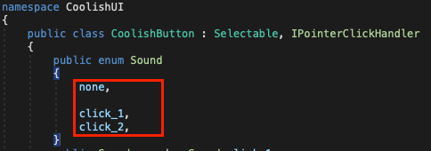
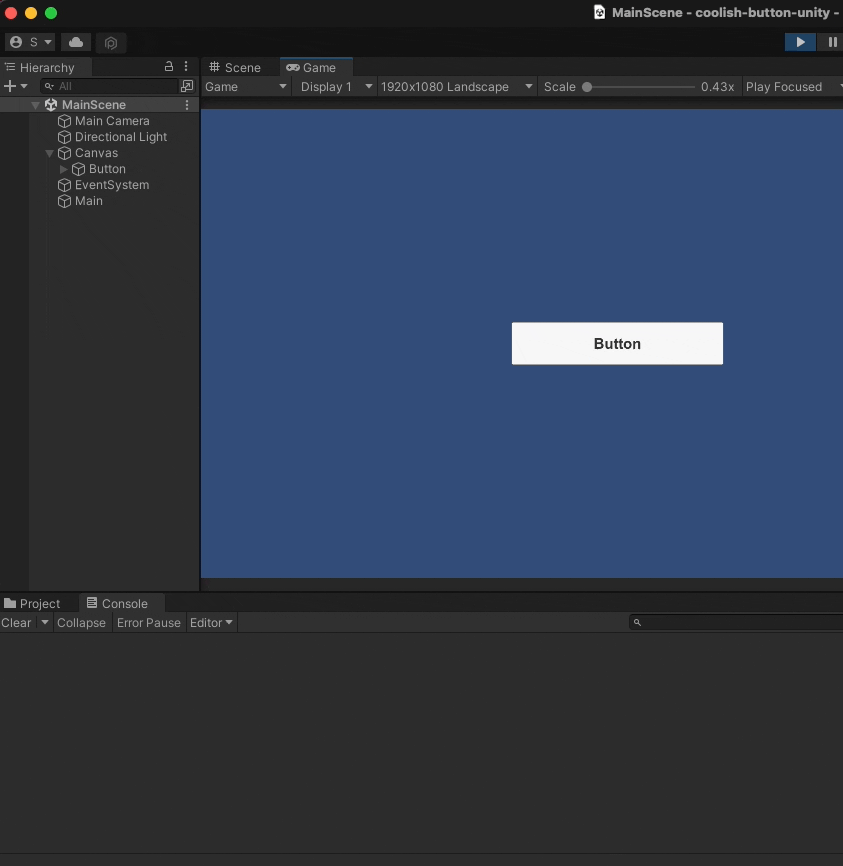

# coolish-button-unity

The CoolishButton is a custom ugui button script that provides button sound and scaling animation.

## Installation

You can download also from [Unity Asset Store]()

## Dependencies

* [iTween](https://assetstore.unity.com/packages/tools/animation/itween-84#description)

## Features

- Button Sound
- Button Scaling Animation

## Usage

You can simply create a button from a menu button.

You can also configure it in the inspector.

You can also add sounds.

It is designed to link the sound manager you use.

## ScreenShots

## Support

Please visit this repository's [Github issue tracker](https://github.com/coolishbee/coolish-button-unity/issues) for feature requests and bug reports related specifically to the Tool.

For other any questions, send us an email to chc3484@gmail.com